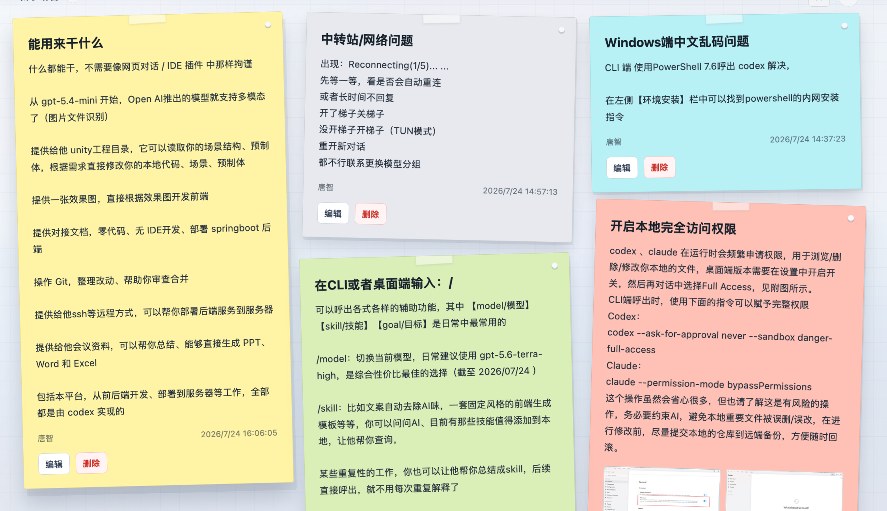

# Noteboard

A lightweight, self-contained sticky-note board for administrators. It is a Vue 3 frontend with local demo persistence, category ordering, image attachments, and a component boundary that can be connected to any backend.

<p align="center">
  <a href="./public/noteboard-demo.mp4"></a>
</p>

Demo video: [noteboard-demo.mp4](./public/noteboard-demo.mp4)

## Included

- Administrator note creation, editing, and deletion.
- Category groups, masonry layout, and collapse state.
- Persistent category ordering with native drag and keyboard-accessible move controls.
- An `Uncategorized` group that always remains last.
- Six note colors, local image uploads or paste, and an image lightbox.
- IndexedDB-backed demo data, with a LocalStorage fallback and no accounts, API keys, product branding, or service dependencies.
- Responsive layout and reduced-motion support.

## Run locally

```sh
pnpm install
pnpm dev
```

Validate a change:

```sh
pnpm typecheck
pnpm test
pnpm build
```

`pnpm build:demo` writes the standalone site to `demo-dist/`; `pnpm build:lib`
writes the publishable component package to `dist/`.

## Reuse in another project

`src/components/NoteBoard.vue` is deliberately independent of routing, authentication, stores, and HTTP clients. Supply `notes`, `categoryOrder`, and asynchronous persistence callbacks from the host application.

```vue
<NoteBoard
  :notes="notes"
  :category-order="categoryOrder"
  :mutations="mutations"
/>
```

```ts
import type { NoteBoardMutations } from "@cannontang/noteboard";

const mutations: NoteBoardMutations = {
  create: async (draft) => {
    /* persist a new note */
  },
  update: async (id, draft) => {
    /* persist the edit */
  },
  remove: async (id) => {
    /* delete the note */
  },
  saveCategoryOrder: async (categories) => {
    /* persist the order */
  },
};
```

The contracts are exported from `src/types.ts`. Rejected callbacks keep the active dialog open and display the returned error, so a host can safely surface API failures. A host owns authorization and storage. Category order is an array of category names; it excludes `Uncategorized`, which the board reserves as the last group. When the host receives an order update it should validate that every existing non-reserved category occurs exactly once before saving it.

The bundled demo intentionally persists images as data URLs, so it limits each image to 1 MB and four images per note. A production integration should replace this with its own upload flow and store image URLs in `NoteImage`.

## Project layout

```text
src/components/   Reusable board, editor, note card, ordering dialog
src/lib/          Deterministic grouping/order rules and local demo storage
src/types.ts      Public note and board types
public/           README preview and demonstration video
```

## License

[MIT](./LICENSE)
